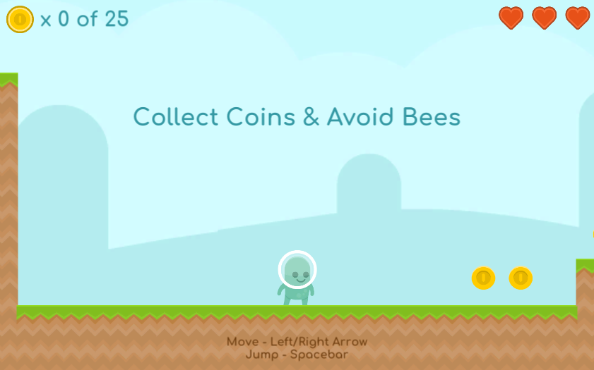

<h1 align="center">Coin Bees</h1>
<h3 align="center">Simple 2D platformer made using Unity v2020.3.18 and Kenney's 2D platformer assets.</h3>
 

<ul>
<li><b>Play live: </b> <a href="https://zedrex.itch.io/coin-bees">zedrex.itch.io/coin-bees</a></li>
<li><b>Built with:</b> Unity 2020.3.18f1</li>
<li><b>Asset pack:</b><a href="https://www.kenney.nl/assets/platformer-pack-redux"> Kenney's Platformer Art Redux</a></li>
</ul>
 

<h2>Screenshot</h2>

